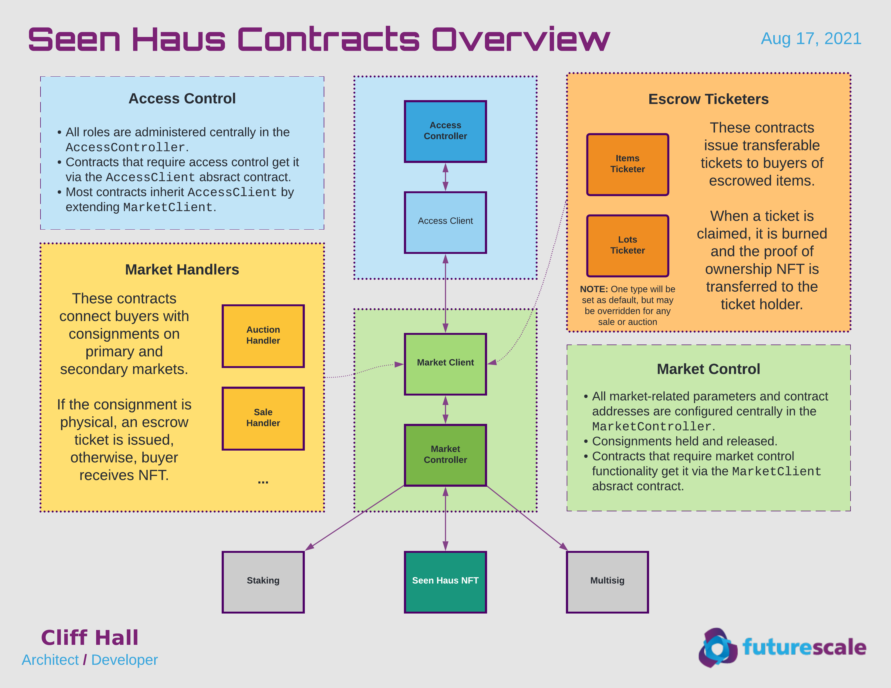
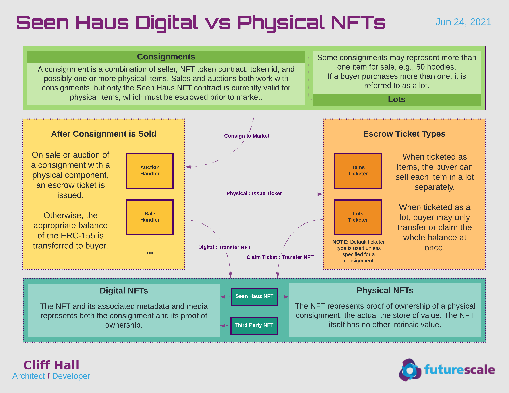

# Seen Haus Contracts
## Status
  - Ready for audit
  - Contracts are proxied and upgradable
  - 400+ unit tests with 99% code coverage
  - Deployment scripts with automatic Etherscan verification of each contract

## Overview


## Access Control


## Digital vs Physical


## Market Diamond


## Sequences: Mint + Market


# Developer Setup
## Prerequisites
### Install Node (also installs NPM)
 * [Get Node](https://nodejs.org/en/download/)

### Install required Node modules
All NPM resources are project-local. No global installs required. 

```
cd path/to/seen-contracts
npm install
```

### Configure Environment
Create a file called `environments.js` with 
- The following info for each Ethereum network environment.
  * `txNode`: the endpoint for sending ethereum transactions
  * `mnemonic`: a valid ethereum HD wallet seed phrase

- The following info for verifying code on Etherscan and running the gas reporter
  * `etherscan.apiKey`: your etherscan API key
  * `coinmarketcap.apiKey`: your coinmarketcap API key

```javascript
module.exports = {
    "etherscan": {
        "apiKey": "<YOUR_ETHERSCAN_API_KEY>"
    },

  "coinmarketcap": {
    "apiKey": "<YOUR_COINMARKETCAP_API_KEY>"
  },

  "rinkeby": {
        "txNode": "https://rinkeby.infura.io/v3/<YOUR_INFURA_API_KEY>",
        "mnemonic": "<YOUR_UNIQUE_TWELVE_WORD_WALLET_SEED_PHRASE>"
  },

  "mainnet": {
        "txNode": "https://mainnet.infura.io/v3/<YOUR_INFURA_API_KEY>",
        "mnemonic": "<YOUR_UNIQUE_TWELVE_WORD_WALLET_SEED_PHRASE>"
    }

};
```

# Development Tasks
## NPM Scripts
### Build the contracts
This creates the build artifacts for deployment or testing

```npm run build```

### Test the contracts
This builds the contracts and runs the unit tests.

```npm run test```

### Deploy to Hardhat network
This deploys the built contracts to local network (mainly to test deployment script)

```npm run deploy:local```

### Deploy to Rinkeby
This deploys the built contracts to Rinkeby

```npm run deploy-suite:rinkeby```

### Deploy to Mainnet
This deploys the built contracts to Mainnet

```npm run deploy-suite:mainnet```

### Manage Roles on Rinkeby
This runs the `scripts/manage-roles.js` script.

```npm run manage-roles:rinkeby```

### Manage Roles on Mainnet
This runs the `scripts/manage-roles.js` script against mainnet.

```npm run manage-roles:mainnet```
